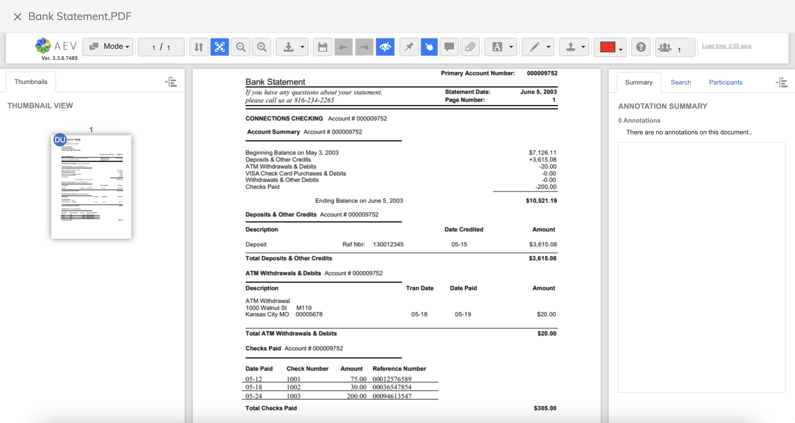

#### Alfresco Digital Workspace (ADW) Application where user can choose between Standard Document Viewer or Alfresco Enterprise Viewer (AEV).

### Use-Case / Requirement

Users should have the flexibility to choose between:
1. Standard Document Viewer
2. Alfresco Enterprise Viewer

### Prerequisites to run this demo end-2-end

* Alfresco Digital Business Platform
* Alfresco Content Services (Version 6.1 and above)
* Alfresco Process Services (Version 2.x and above)

## Modes
This article details the steps for the following Modes
* Production Mode - Please download the production build [available here](assets/prod-build/html.zip). The downloaded zip file can be deployed on NGINX server or Tomcat server. 

* Development Mode - Developers could download the code, install dependencies and compile and run the code to generate the desired output. Please refer to the below steps.


## Production Mode

> The below steps are for Alfresco Demo Platform (ADP) Users.

ADP Users can use NGINX to deploy the production build. Please follow the below steps.

1. Transfer the `html.zip` file to NGINX folder at EC2 Instance.
    ```
    scp -i my-aws-key.pem html.zip ec2-user@ec2-1-2-3-4.compute-1.amazonaws.com:/home/ec2-user/adp/data/services/nginx
    ```

2. Connect to EC2 Instance using SSH.
    ```
    ssh -i "my-aws-key.pem" ec2-user@ec2-1-2-3-4.compute-1.amazonaws.com
    ```

3. Navigate to NGINX Folder.
    ```
    cd data/services/nginx
    ```

4. Rename existing `html` folder.
    ```
    mv html/ html-old/
    ```

5. Unzip `html.zip` file.
    ```
    unzip html.zip
    ```

6. Navigate back to ADP Level.
    ```
    cd ../../../
    ```

7. Stop NGINX.
    ```
    ./adp.py stop nginx
    ```

8. Start NGINX.
    ```
    ./adp.py start nginx
    ```

9. Navigate to Alfresco Digital Workspace in a new browser.
    

10. Login and Go to Settings.
    

11. Select the Document Viewer.
    
    

12. Apply and Open a document to view in AEV.
    


## Development Mode

1. Download Source code
The source code of Alfresco Digital Workspace (ADW) Application can be downloaded from [Nexus Repository](https://nexus.alfresco.com/) for Alfresco Enterprise Customers.

    P.S : The source code of this Custom ADW application is [available here](assets/source-code/).
<br/>
2. Install the dependencies
Open a command prompt and run the following command to install all third-party dependencies.
    ``` 
    npm ci
    ```

3. Run the following command to run the application.
    ``` 
    npm start content-ee 
    ```

4. Run the following command to build the application to deploy or server.
    ``` 
    npm run build content-ee 
    ```

5. Navigate to Alfresco Digital Workspace in a new browser.
    

6. Login and Go to Settings.
    

7. Select the Document Viewer.
    
    

8. Apply and Open a document to view in AEV.
    

More details are available at https://docs.alfresco.com/digital-workspace/3.1/develop/deploy/#deploy-digital-workspace

### References

1. https://docs.alfresco.com/digital-workspace/3.1/develop/deploy/#deploy-digital-workspace
