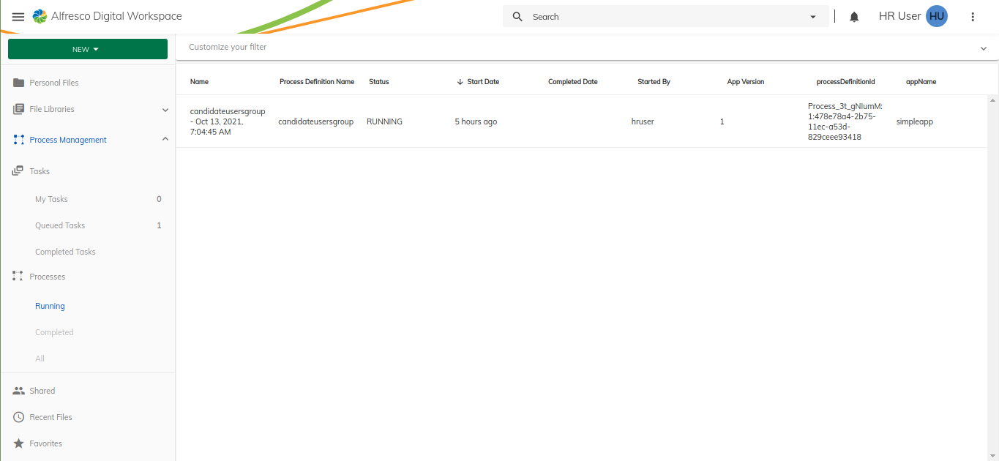

# Extending Process List with custom columns

In this tutorial, we are going to learn how to configure process list columns:

- [Add/Edit a column in the Process list using a process instance property](#add-or-edit-a-column-in-the-process-list-using-a-process-instance-property)
- [Replace a default presets in the Process list](#replace-a-default-presets-in-the-process-list)
- [Add a column in the Process list using a custom template](#add-a-column-in-the-process-list-using-a-custom-template)


By default Process list is configured with few default columns in the `/assets/process-services-cloud.extension.json` of the [ProcessServicesCloud extension library ](../../../libs/content-ee/process-services-cloud-extension).


```json
{
  "features": {
    "processList": {
        "presets": {
            "default": [
                ...columns schema
            ]
        }
    }
  }
}
```
Displays process list with default columns preset



## Add or Edit a column in the Process list using a process instance property

Update the `/assets/process-services-cloud.extension.json` file, and insert/edit a entry to the `features.processList.presets.default` section:

```json
{
  "features": {
    "processList": {
        "presets": {
            "default": [
                { ...Default Columns schema },
                {
                    "id": "app.process.processDefinitionId",
                    "key": "processDefinitionId",
                    "type": "text",
                    "title": "ProcessDefinitionId",
                    "sortable": true
                },
                {
                    "id": "app.process.appName",
                    "key": "appName",
                    "type": "text",
                    "title": "appName",
                    "sortable": true
                }
            ]
        }
    }
  }
}
```
Now, once you run the application, you should see an extra columns in the process list that contains the new columns.

Displays process list with new columns


## Replace a default presets in the Process list

You can define your own set of columns instead of default one. Update the `/assets/process-services-cloud.extension.json` file with the new set of columns..

```json
{
  "features": {
    "processList": {
        "presets": {
            "default": [
                { ...Default Columns schema },
            ],
            "my-process-presets": [
                {
                    "id": "app.process.id",
                    "key": "id",
                    "type": "text",
                    "title": "Process Id",
                    "sortable": true
                },
                                {
                    "id": "app.process.name",
                    "key": "name",
                    "type": "text",
                    "title": "Name",
                    "sortable": true
                },
                {
                    "id": "app.process.appName",
                    "key": "appName",
                    "type": "text",
                    "title": "App Name",
                    "sortable": true
                }
            ]
        }
    }
  }
}
```

Once json updated, you can fetch the preset by changing the key from `default to my-process-presets` in the [ProcessListCloudExtComponent](../../../libs/content-ee/process-services-cloud-extension/src/lib/features/process-list/components/process-list/process-list-cloud-ext.component.ts)

```typescript
  this.columns = this.extensions.getProcessColumns('my-process-presets');
```
Displays process list with new columns preset


## Add a column in the Process list using a custom template

As a first step we should create a custom component in our extension `(i.e process-services-cloud extension library)`:

For example, let's create custom templates for the process name, status properties.

```typescript
import { ChangeDetectionStrategy, Component, Input, OnInit, ViewEncapsulation } from '@angular/core';
import { ProcessInstanceCloud } from '@alfresco/adf-process-services-cloud';

@Component({
  selector: 'custom-template-name-column',
  template: `
      <mat-list>
        <mat-list-item>
            <div mat-line>{{ displayValue.name }}</div>
            <div mat-line [ngStyle]="{ 'padding-top': '5px' }">
                <span [ngStyle]="{ 'font-weight': 'bold' }">{{ 'ADF_CLOUD_PROCESS_LIST.PROPERTIES.STARTED_BY' | translate }} :</span>
                <span> {{ displayValue.initiator }}</span>
            </div>
        </mat-list-item>
      </mat-list>
    `,
  changeDetection: ChangeDetectionStrategy.OnPush,
  encapsulation: ViewEncapsulation.None,
  host: { class: 'adf-datatable-content-cell adf-name-column' },
})
export class ProcessNameComponent implements OnInit {

  @Input()
  context: any;

  displayValue: ProcessInstanceCloud;

  constructor() {}

  ngOnInit() {
    this.displayValue = this.context?.row?.obj;
  }
}
```


```typescript
import { ChangeDetectionStrategy, Component, Input, OnInit, ViewEncapsulation } from '@angular/core';
import { ProcessInstanceCloud } from '@alfresco/adf-process-services-cloud';

@Component({
  selector: 'custom-template-status-column',
  template: `
    <mat-chip-list>
        <mat-chip>
            <div [ngStyle]="{ 'padding-right': '5px' }">
                <mat-icon *ngIf="displayValue.status === 'COMPLETED'" [ngStyle]="{ 'color': 'green' }">check_circle</mat-icon>
                <mat-icon *ngIf="displayValue.status === 'RUNNING'"   [ngStyle]="{ 'color': 'green' }">settings</mat-icon>
                <mat-icon *ngIf="displayValue.status === 'SUSPENDED'" [ngStyle]="{ 'color': 'red' }">block</mat-icon>
                <mat-icon *ngIf="displayValue.status === 'CANCELLED'" [ngStyle]="{ 'color': 'red' }">highlight_off</mat-icon>
            </div>
            <span>{{displayValue.status}}</span>
        </mat-chip>
    </mat-chip-list>
    `,
  changeDetection: ChangeDetectionStrategy.OnPush,
  encapsulation: ViewEncapsulation.None,
  host: { class: 'adf-datatable-content-cell adf-name-column' },
})
export class ProcessStatusComponent implements OnInit {

  @Input()
  context: any;

  displayValue: ProcessInstanceCloud;

  constructor() {}

  ngOnInit() {
    this.displayValue = this.context?.row?.obj;
  }
}
```

And register these custom components in the [processListModule](../../../libs/content-ee/process-services-cloud-extension/src/lib/features/process-list/process-list.module.ts). In order to understand how to register a custom component refer to the [Registration](https://github.com/Alfresco/alfresco-content-app/blob/develop/docs/extending/registration.md) documentation


```typescript
@NgModule({
    declarations: [ ProcessNameComponent, ProcessStatusComponent ]
})

export class ProcessListCloudModule {
    constructor(extensions: ExtensionService) {
        extensions.setComponents({
            'app.processList.columns.name': ProcessNameComponent,
            'app.processList.columns.status': ProcessStatusComponent
        });
    }
}
```

Once your components are registered.

Register your new template component:

Add your new Column in `your-app.extensions.json` :

```json
{
  "features": {
    "processList": {
        "presets": {
            "default": [
                {
                  "id": "app.process.name",
                  "key": "name",
                  "title": "ADF_CLOUD_PROCESS_LIST.PROPERTIES.NAME",
                  "type": "text",
                  "template": "app.processList.columns.name",
                  "sortable": true
                },
                {
                  "id": "app.process.status",
                  "key": "status",
                  "title": "ADF_CLOUD_PROCESS_LIST.PROPERTIES.STATUS",
                  "type": "text",
                  "template": "app.processList.columns.status",
                  "sortable": true
                }
            ]
        }
    }
  }
}
```

Now, once you run the application, you should see a custom columns in the process list that contains the new custom template columns.

Displays process list with custom column template


