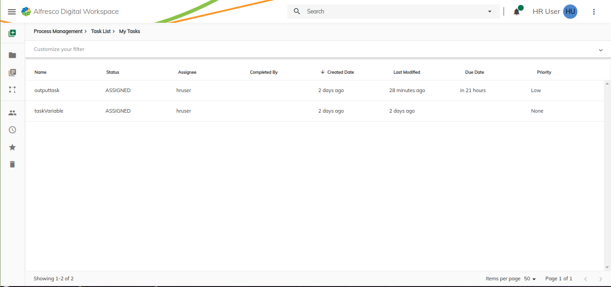
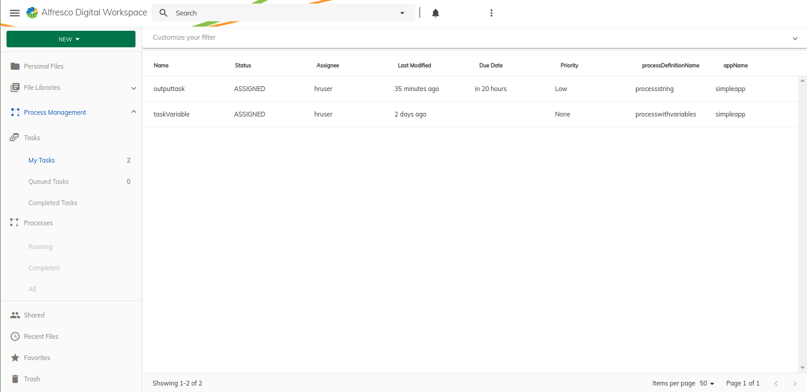
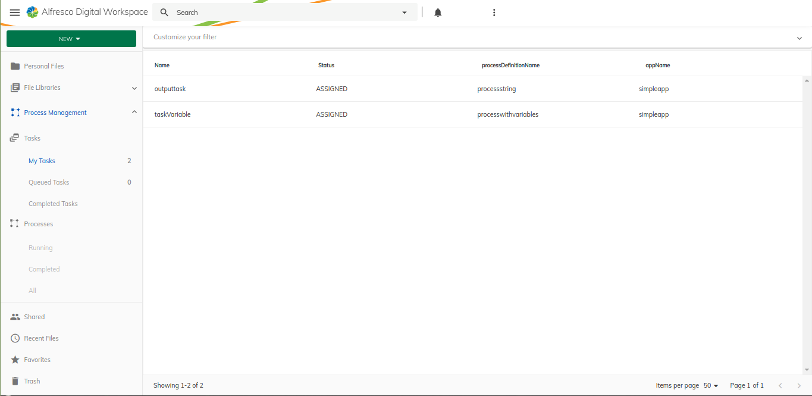
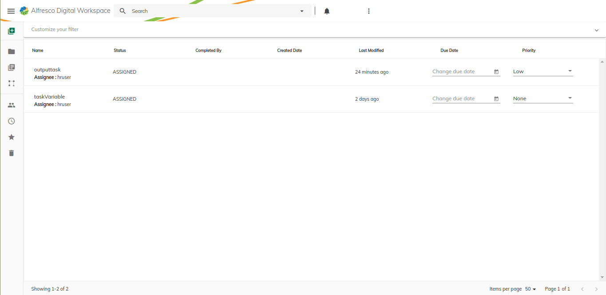

# Extending Task List with custom columns

In this tutorial, we are going to learn how to configure task list columns:

- [Add/Edit a column in the Task list using a task property](#add-or-edit-a-column-in-the-task-list-using-a-task-property)
- [Replace a default presets in the Task list](#replace-a-default-presets-in-the-task-list)
- [Add a column in the Task list using a custom template](#add-a-column-in-the-task-list-using-a-custom-template)


By default Task list is configured with few default columns in the `/assets/process-services-cloud.extension.json` of the [ProcessServicesCloud extension library ](../../../libs/content-ee/process-services-cloud-extension).


```json
{
  "features": {
    "taskList": {
        "presets": {
            "default": [
                ...columns schema
            ]
        }
    }
  }
}
```
Displays task list with default columns preset



## Add or Edit a column in the Task list using a task property

Update the `/assets/process-services-cloud.extension.json` file, and insert/edit a entry to the `features.taskList.presets.default` section:

```json
{
  "features": {
    "taskList": {
        "presets": {
            "default": [
                { ...Default Columns schema },
                {
                    "id": "app.task.processDefinitionName",
                    "key": "processDefinitionName",
                    "type": "text",
                    "title": "processDefinitionName",
                    "sortable": true
                },
                {
                    "id": "app.task.appName",
                    "key": "appName",
                    "type": "text",
                    "title": "appName",
                    "sortable": true
                }
            ]
        }
    }
  }
}
```
Now, once you run the application, you should see an extra columns in the task list that contains the new columns.

Displays task list with new columns



## Replace a default presets in the Task list

You can define your own set of columns instead of default one. Update the `/assets/process-services-cloud.extension.json` file with the new set of columns..

```json
{
  "features": {
    "taskList": {
        "presets": {
            "default": [
                { ...Default Columns schema },
            ],
            "my-task-presets": [
                {
                    "id": "app.task.name",
                    "key": "name",
                    "type": "text",
                    "title": "Name",
                    "sortable": true
                },
                {
                    "id": "app.task.status",
                    "key": "status",
                    "type": "text",
                    "title": "Status",
                    "sortable": true
                },
                {
                    "id": "app.task.processDefinitionName",
                    "key": "processDefinitionName",
                    "type": "text",
                    "title": "processDefinitionName",
                    "sortable": true
                },
                {
                    "id": "app.task.appName",
                    "key": "appName",
                    "type": "text",
                    "title": "appName",
                    "sortable": true
                }
            ]
        }
    }
  }
}
```

Once json updated, you can fetch the preset by changing the key from `default to my-task-presets` in the [TaskListCloudExtComponent](../../../libs/content-ee/process-services-cloud-extension/src/lib/features/task-list/components/task-list/task-list-cloud-ext.component.ts)

```typescript
  this.columns$ = this.extensions.getTaskColumns('my-task-presets');
```
Displays task list with new columns preset



## Add a column in the Task list using a custom template

As a first step we should create a custom component in our extension `(i.e process-services-cloud extension library)`:

For example, let's create custom templates for the task name, due date and priority properties.

```typescript
import { ChangeDetectionStrategy, Component, Input, OnInit, ViewEncapsulation } from '@angular/core';
import { TaskDetailsCloudModel } from '@alfresco/adf-process-services-cloud';

@Component({
  selector: 'custom-template-name-column',
  template: `
    <mat-list>
        <mat-list-item>
            <div mat-line>{{ displayValue.name }}</div>
            <div mat-line [ngStyle]="{ 'padding-top': '5px' }">
                <span [ngStyle]="{ 'font-weight': 'bold' }">Assignee :</span>
                <span> {{ displayValue.assignee }}</span>
            </div>
        </mat-list-item>
    </mat-list>
    `,
  host: { class: 'adf-datatable-content-cell adf-name-column' },
})
export class TaskNameComponent implements OnInit {

  @Input()
  context: any;

  displayValue: TaskDetailsCloudModel;

  constructor() {}

  ngOnInit() {
    this.displayValue = this.context?.row?.obj;
  }
}
```

```typescript
import { Component, Input, OnInit } from '@angular/core';
import { TaskDetailsCloudModel } from '@alfresco/adf-process-services-cloud';

@Component({
  selector: 'custom-template-priority-column',
  template: `
    <mat-form-field>
      <mat-label>Change Priority</mat-label>
      <mat-select [(ngModel)]="selectedValue" name="priority">
        <mat-option *ngFor="let priority of priorities" [value]="priority">
          {{priority}}
        </mat-option>
      </mat-select>
    </mat-form-field>
    `,
  host: { class: 'adf-datatable-content-cell adf-name-column' },
})
export class TaskPriorityComponent implements OnInit {

  @Input()
  context: any;

  displayValue: TaskDetailsCloudModel;

  priorities: string[] = ['None', 'High', 'Low', 'Normal'];
  selectedValue: string;

  constructor() {}

  ngOnInit() {
    this.displayValue = this.context?.row?.obj;
    this.selectedValue = this.displayValue.priority;
  }
}
```

```typescript
import { Component, Input, OnInit } from '@angular/core';
import { ProcessInstanceCloud } from '@alfresco/adf-process-services-cloud';

@Component({
  selector: 'custom-template-duedate-column',
  template: `
    <mat-form-field>
        <input matInput [matDatepicker]="picker" placeholder="Change due date" />
        <mat-datepicker-toggle matSuffix [for]="picker"></mat-datepicker-toggle>
        <mat-datepicker #picker></mat-datepicker>
    </mat-form-field>
    `,
  host: { class: 'adf-datatable-content-cell adf-name-column' },
})
export class TaskDueDateComponent implements OnInit {

  @Input()
  context: any;

  displayValue: TaskDetailsCloudModel;

  constructor() {}

  ngOnInit() {
    this.displayValue = this.context?.row?.obj;
  }
}
```

And register these custom components in the [TaskListModule](../../../libs/content-ee/process-services-cloud-extension/src/lib/features/task-list/task-list.module.ts). In order to understand how to register a custom component refer to the [Registration](https://github.com/Alfresco/alfresco-content-app/blob/develop/docs/extending/registration.md) documentation


```typescript
@NgModule({
    declarations: [TaskNameComponent, TaskPriorityComponent, TaskDueDateComponent ]
})

export class TasksListCloudModule {
    constructor(extensions: ExtensionService) {
        extensions.setComponents({
            'app.taskList.columns.name': TaskNameComponent,
            'app.taskList.columns.priority': TaskPriorityComponent,
            'app.taskList.columns.dueDate': TaskDueDateComponent
        });
    }
}
```

Once your components are registered.

Register your new template component:

Add your new Column in `your-app.extensions.json` :

```json
{
  "features": {
    "taskList": {
        "presets": {
            "default": [
                {
                  "id": "app.task.name",
                  "key": "name",
                  "title": "Name",
                  "type": "text",
                  "template": "app.taskList.columns.name",
                  "sortable": true
                },
                {
                  "id": "app.task.dueDate",
                  "key": "status",
                  "title": "Due Date",
                  "type": "text",
                  "template": "app.taskList.columns.dueDate",
                  "sortable": true
                },
                {
                  "id": "app.task.priority",
                  "key": "priority",
                  "title": "Priority",
                  "type": "text",
                  "template": "app.taskList.columns.priority",
                  "sortable": true
                }
            ]
        }
    }
  }
}
```

Now, once you run the application, you should see a custom columns in the tak list that contains the new custom template columns.

Displays task list with custom column template


