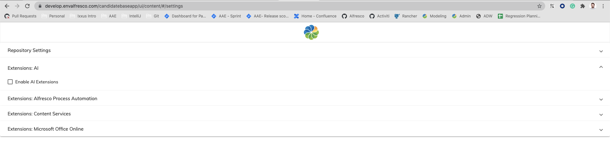

# AI Extension

This library was generated with [Angular CLI](https://github.com/angular/angular-cli) version 9.0.5.

## About
This library is divided into two sections.

1. AI extension - Override of search and content meta data for ai models
1. Viewer extension - This is an experimental feature that is by default deactivated.

### How do I turn on the AI extension?
 set the property `APP_CONFIG_PLUGIN_AI_SERVICE` to `true`.

### How do I turn on the Viewer extension?
 set the above env variable and In the application settings, enable the AI plugin.
 
