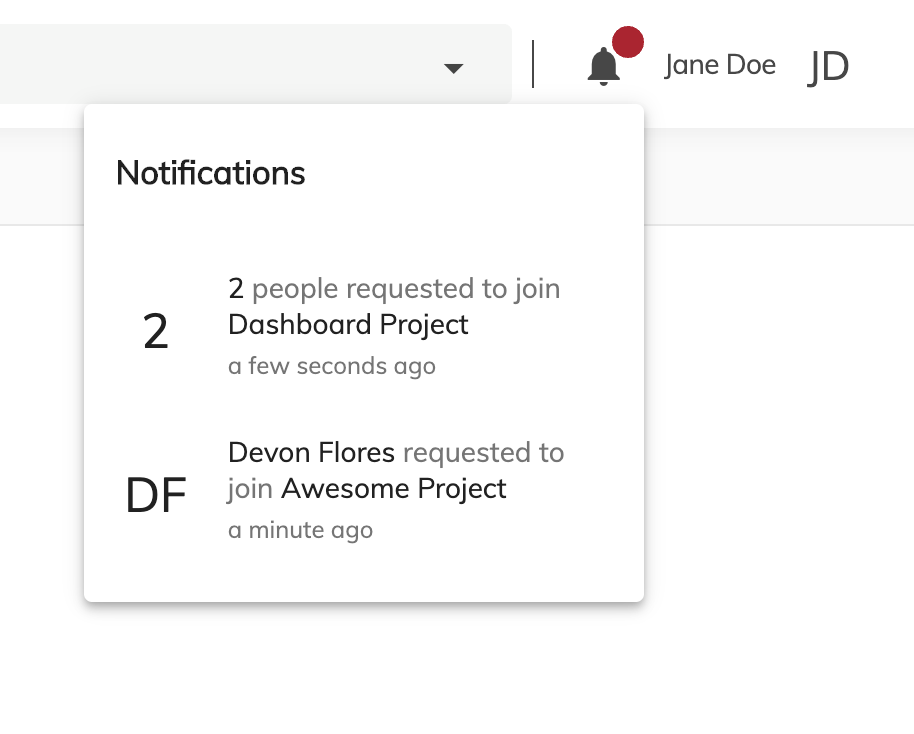

# [Library Notifications Component](../src/lib/components/library-notifications/library-notifications.component.ts)

Displays requests to join a library



## Basic Usage

```html
    <acs-library-notifications></acs-library-notifications>
```

## Details
The frequency of pooling can be configured from `app.config.json` via `notificationsPooling` property. If the property it's not declared, it defaults to `30000`

```json
    {
        ...
        "notificationsPooling": 1000000,
        ...
    }
```
