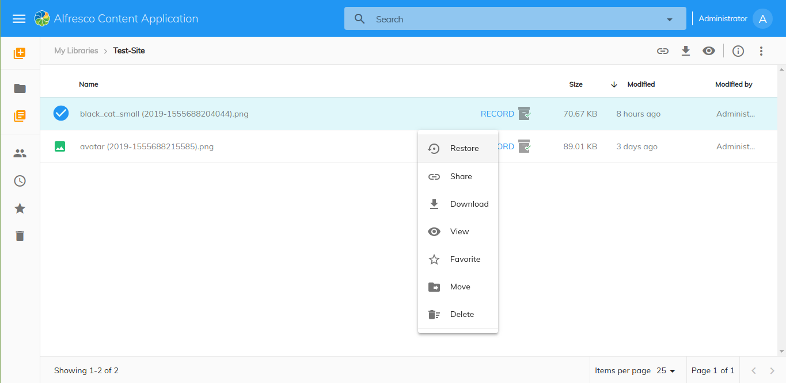
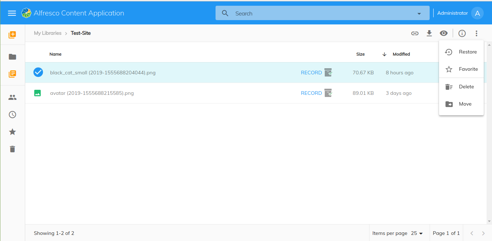

# [Glacier Restore Record](../../assets/governance-glacier.plugin.json)

Displays the `Restore` action. We can able to restore the Item(Node/Record) using Glacier plugin.





## Basic Usage

Add the reference in `app.extensions.json`:

```json
  "$references": [
    "governance-glacier.plugin.json"
  ],
```

## Details

This component is an extension applied to ACA application that will show the `Restore` action in the context menu and in the toolbar.

## Note

Glacier restore will have following steps due to insufficient backend service info
ie `Currently Restore api is failing silently.`

1. Restore Service called using Action Api
2. Download Node content (here Glacier Extension update node information if all the operations are success). It will take few seconds to update node info
3. Get Node info to check whether everything is success or not
4. If note is not updated, Poll Node info (5 times) to check whether everything is success or not
5. if node is not updated After polling, show error message
