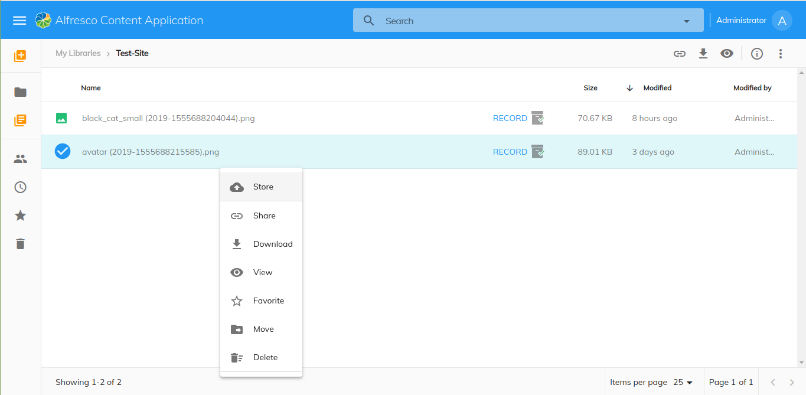
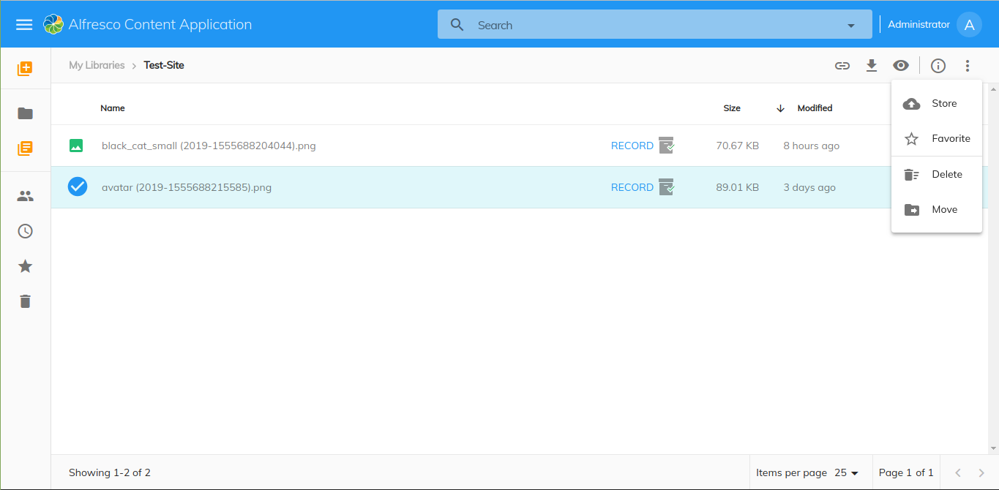

# [Glacier Store Record](../../assets/governance-glacier.plugin.json)

Displays the `Store` action. We can able to store the Item(Node/Record) using Glacier plugin.





## Basic Usage

Add the reference in `app.extensions.json`:

```json
  "$references": [
    ...
    "governance-glacier.plugin.json"
  ],
```

## Details

This component is an extension applied to ACA application that will show the `Store` action in the context menu and in the toolbar.
