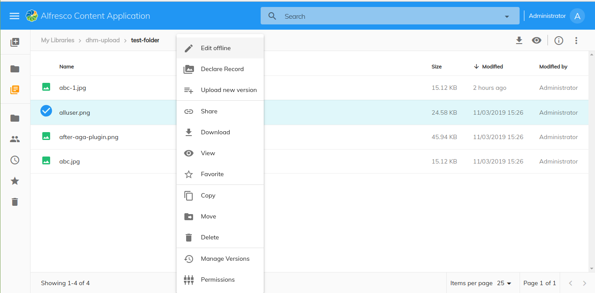

# [Declare Record](../../src/lib/record/effects/declare-record.effect.ts)

Displays the `Declare Record` action.



## Basic Usage

Add the reference in `app.extensions.json`:

```json
  "$references": [
    "governance.plugin.json"
  ],
```

## Details

This component is an extension applied to ACA application that will show the `Declare as Record` action in the context menu and in the toolbar when the node selected is _not_ a record.
