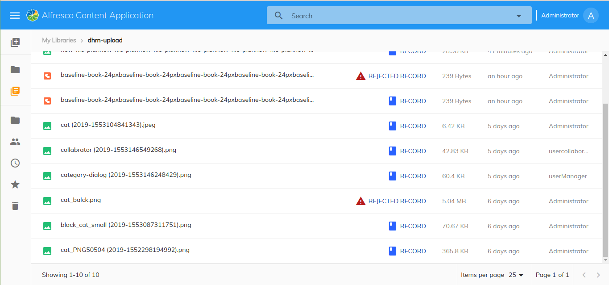

# [Record Name Component](../../src/lib/record/components/record-name/record-name.component.ts)

Displays the record rejection bar on the top of the name.



## Basic Usage

Add the reference in `app.extensions.json`:

```json
  "$references": [
    "governance.plugin.json"
  ],
```

## Details

This component is an extension applied to ACA application that will show the record rejection bar on the top of the name.

```html
<aga-record-column> </aga-record-column>
```
