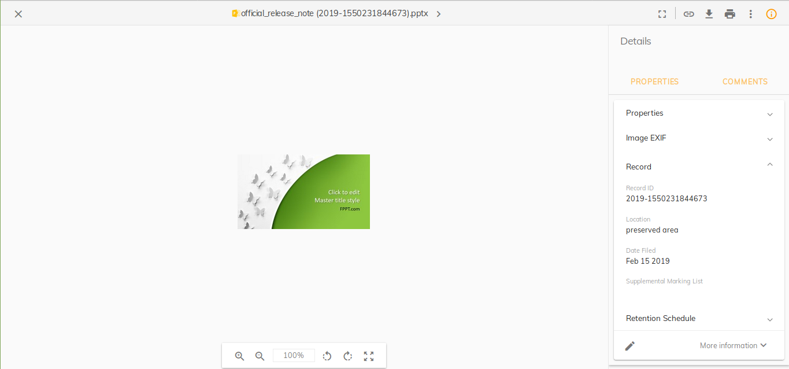

# [Record Properties](../../assets/governance.plugin.json)

Displays the selected _record information_ in the side bar(aka Info Drawer).



## Basic Usage

Add the reference in `app.extensions.json`:

```json
  "$references": [
    "governance.plugin.json"
  ],
```

## Details

This plugin is an extension applied to ACA application that will show the record _information_ in the side bar(aka Info Drawer) when the node selected is a record.
